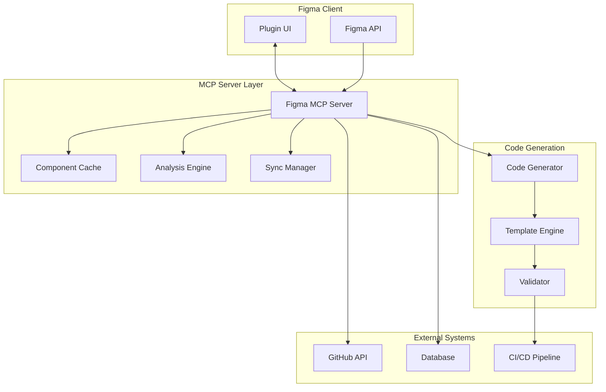

# 🔗 Figma MCP Server와 Code Generator 통합 전략

## MCP Server 역할 정의

### 현재 상황
- **Figma Plugin**: 프론트엔드, 사용자 인터페이스
- **Code Generator**: 핵심 로직, 코드 변환
- **MCP Server**: 데이터 처리, API 중간층, 자동화

## 🏗️ 통합 아키텍처



## 🎯 MCP Server의 핵심 역할

### 1. **데이터 수집 및 캐싱**

```typescript
// figma-mcp-server/src/handlers/component-sync.ts

class ComponentSyncHandler {
  async syncComponents(fileKey: string): Promise<ComponentData[]> {
    // 1. Figma API로 최신 데이터 가져오기
    const figmaData = await this.figmaAPI.getFile(fileKey);
    
    // 2. 변경사항 감지
    const changes = await this.detectChanges(figmaData);
    
    // 3. 캐시 업데이트
    await this.updateCache(changes);
    
    // 4. 플러그인에 변경사항 알림
    await this.notifyPlugins(changes);
    
    return changes;
  }
  
  // 실시간 변경 감지
  async watchChanges(fileKey: string) {
    setInterval(async () => {
      const hasChanges = await this.checkForUpdates(fileKey);
      if (hasChanges) {
        await this.syncComponents(fileKey);
      }
    }, 30000); // 30초마다 체크
  }
}
```

### 2. **지능형 분석 엔진**

```typescript
// figma-mcp-server/src/analysis/component-analyzer.ts

class ComponentAnalyzer {
  async analyzeComponent(componentId: string): Promise<ComponentAnalysis> {
    const component = await this.getComponent(componentId);
    
    return {
      // 컴포넌트 복잡도 분석
      complexity: this.calculateComplexity(component),
      
      // 재사용 패턴 분석
      reusability: this.analyzeReusability(component),
      
      // 코드 생성 가능성
      codeGenerationViability: this.assessCodeGeneration(component),
      
      // 권장 개선사항
      recommendations: this.generateRecommendations(component),
      
      // 유사 컴포넌트 찾기
      similarComponents: await this.findSimilarComponents(component)
    };
  }
  
  // AI 기반 패턴 인식
  async detectPatterns(components: Component[]): Promise<Pattern[]> {
    const patterns = [];
    
    // 반복되는 구조 패턴 감지
    const structuralPatterns = this.findStructuralPatterns(components);
    
    // 스타일 패턴 감지
    const stylePatterns = this.findStylePatterns(components);
    
    // 네이밍 패턴 분석
    const namingPatterns = this.analyzeNamingPatterns(components);
    
    return [...structuralPatterns, ...stylePatterns, ...namingPatterns];
  }
}
```

### 3. **코드 생성 오케스트레이션**

```typescript
// figma-mcp-server/src/generation/generation-orchestrator.ts

class GenerationOrchestrator {
  async generateCode(request: GenerationRequest): Promise<GenerationResult> {
    const { componentId, format, options } = request;
    
    // 1. 컴포넌트 데이터 준비
    const componentData = await this.prepareComponentData(componentId);
    
    // 2. 생성 전 분석
    const analysis = await this.analyzer.analyzeComponent(componentId);
    
    // 3. 템플릿 선택
    const template = await this.selectOptimalTemplate(analysis, format);
    
    // 4. 코드 생성
    const generatedCode = await this.generator.generate({
      component: componentData,
      template,
      options: {
        ...options,
        optimizations: analysis.recommendations
      }
    });
    
    // 5. 품질 검증
    const validation = await this.validator.validate(generatedCode);
    
    // 6. 최적화 적용
    const optimizedCode = await this.optimizer.optimize(generatedCode, analysis);
    
    return {
      code: optimizedCode,
      metadata: {
        generatedAt: new Date(),
        template: template.name,
        quality: validation.score,
        optimizations: analysis.recommendations
      }
    };
  }
}
```

### 4. **자동화 및 CI/CD 통합**

```typescript
// figma-mcp-server/src/automation/sync-automation.ts

class SyncAutomation {
  private githubClient: GitHubClient;
  private slackClient: SlackClient;
  
  async handleAutomaticSync(fileKey: string) {
    try {
      // 1. 변경사항 감지
      const changes = await this.detectChanges(fileKey);
      
      if (changes.length === 0) return;
      
      // 2. 영향도 분석
      const impact = await this.analyzeImpact(changes);
      
      // 3. 자동 vs 수동 결정
      if (impact.isBreaking) {
        // Breaking change는 수동 처리
        await this.notifyTeam(impact);
      } else {
        // Non-breaking은 자동 처리
        await this.processAutomatically(changes);
      }
      
    } catch (error) {
      await this.handleError(error);
    }
  }
  
  private async processAutomatically(changes: Change[]) {
    // 1. 코드 생성
    const codes = await Promise.all(
      changes.map(change => this.generateCode(change))
    );
    
    // 2. 테스트 실행
    const testResults = await this.runTests(codes);
    
    // 3. 모든 테스트 통과 시 PR 생성
    if (testResults.allPassed) {
      const pr = await this.createPullRequest({
        title: `[Auto] Sync Figma changes - ${changes.length} components`,
        body: this.generatePRDescription(changes, testResults),
        codes,
        changes
      });
      
      // 4. 팀 알림
      await this.notifySlack({
        message: `🚀 Auto-sync completed! PR: ${pr.url}`,
        changes: changes.length,
        testResults: testResults.summary
      });
    }
  }
}
```

## 🔄 MCP Server Tools 확장

### 기존 Tools 활용
```typescript
// 기존 figma-mcp-server tools 활용
const existingTools = [
  'get_file',           // → 컴포넌트 데이터 가져오기
  'get_components',     // → 컴포넌트 목록 조회
  'get_styles',         // → 스타일 정보 추출
  'export_images'       // → 이미지 에셋 내보내기
];
```

### 새로운 Tools 추가
```typescript
// figma-mcp-server/src/tools/code-generation-tools.ts

export const codeGenerationTools = [
  {
    name: 'analyze_component',
    description: 'Analyze component for code generation readiness',
    inputSchema: {
      type: 'object',
      properties: {
        componentId: { type: 'string' },
        analysisType: { 
          type: 'string', 
          enum: ['complexity', 'reusability', 'patterns', 'all'] 
        }
      }
    }
  },
  
  {
    name: 'generate_component_code',
    description: 'Generate code for a specific component',
    inputSchema: {
      type: 'object',
      properties: {
        componentId: { type: 'string' },
        format: { type: 'string', enum: ['flutter', 'react', 'vue'] },
        options: {
          type: 'object',
          properties: {
            includeStyles: { type: 'boolean' },
            generateTests: { type: 'boolean' },
            optimizeForPerformance: { type: 'boolean' }
          }
        }
      }
    }
  },
  
  {
    name: 'batch_generate_codes',
    description: 'Generate code for multiple components',
    inputSchema: {
      type: 'object',
      properties: {
        componentIds: { type: 'array', items: { type: 'string' } },
        format: { type: 'string' },
        outputFormat: { type: 'string', enum: ['files', 'zip', 'github_pr'] }
      }
    }
  },
  
  {
    name: 'sync_to_repository',
    description: 'Sync generated code to git repository',
    inputSchema: {
      type: 'object',
      properties: {
        repository: { type: 'string' },
        branch: { type: 'string' },
        files: { type: 'array' },
        commitMessage: { type: 'string' }
      }
    }
  },
  
  {
    name: 'detect_component_changes',
    description: 'Detect changes in Figma components since last sync',
    inputSchema: {
      type: 'object',
      properties: {
        fileKey: { type: 'string' },
        since: { type: 'string', format: 'date-time' }
      }
    }
  }
];
```

## 🤖 Claude와의 협업 시나리오

### 1. **AI 기반 코드 리뷰**
```bash
# Claude가 MCP Server를 통해 코드 리뷰
$ claude review-generated-code --component Button --format react

"이 Button 컴포넌트의 접근성이 부족합니다. 
aria-label과 keyboard navigation을 추가하겠습니다."

# MCP Server 호출
analyze_component(componentId: "btn-123", analysisType: "accessibility")
generate_component_code(componentId: "btn-123", options: { includeA11y: true })
```

### 2. **자동 최적화 제안**
```bash
$ claude optimize-design-system --file-key WHtMFm2mn3BOzv62TozBkU

"235개 거래 화면을 분석했습니다. 
11개 중복 패턴을 발견했고, 5개 컴포넌트로 통합 가능합니다."

# MCP Server를 통한 일괄 분석
detect_component_changes(fileKey: "WHtMFm2mn3BOzv62TozBkU")
analyze_component(analysisType: "patterns")
batch_generate_codes(componentIds: [...], format: "react")
```

### 3. **실시간 디자인-개발 동기화**
```bash
$ claude watch-figma-changes --auto-sync

"Document Card 컴포넌트가 변경되었습니다.
영향받는 파일: 23개
자동으로 코드 업데이트하고 PR을 생성하겠습니다."

# 백그라운드 자동화
sync_automation.handleChange(changeEvent)
```

## 📊 MCP Server 대시보드

### 실시간 모니터링
```typescript
// figma-mcp-server/src/dashboard/metrics-collector.ts

interface DashboardMetrics {
  // 동기화 상태
  lastSync: Date;
  componentsInSync: number;
  componentsOutOfSync: number;
  
  // 코드 생성 통계
  codeGenerationsToday: number;
  averageGenerationTime: number;
  successRate: number;
  
  // 품질 지표
  averageCodeQuality: number;
  testPassRate: number;
  
  // 사용 패턴
  mostUsedComponents: string[];
  mostUsedFormats: string[];
  peakUsageHours: number[];
}

class MetricsCollector {
  async collectMetrics(): Promise<DashboardMetrics> {
    return {
      lastSync: await this.getLastSyncTime(),
      componentsInSync: await this.countSyncedComponents(),
      componentsOutOfSync: await this.countOutOfSyncComponents(),
      codeGenerationsToday: await this.countTodaysGenerations(),
      averageGenerationTime: await this.calculateAverageTime(),
      successRate: await this.calculateSuccessRate(),
      averageCodeQuality: await this.calculateQualityScore(),
      testPassRate: await this.calculateTestPassRate(),
      mostUsedComponents: await this.getMostUsedComponents(),
      mostUsedFormats: await this.getMostUsedFormats(),
      peakUsageHours: await this.getPeakUsageHours()
    };
  }
}
```

## 🚀 구현 우선순위

### Phase 1: MCP Server 기반 구조 (2주)
- [ ] 기존 figma-mcp-server 확장
- [ ] 코드 생성 Tools 추가
- [ ] 기본 분석 엔진 구현
- [ ] Plugin ↔ MCP Server 통신

### Phase 2: 자동화 (2주)  
- [ ] 변경 감지 시스템
- [ ] 자동 코드 생성
- [ ] GitHub 통합
- [ ] 알림 시스템

### Phase 3: AI 통합 (2주)
- [ ] Claude 연동
- [ ] 패턴 인식 AI
- [ ] 자동 최적화
- [ ] 지능형 추천

## 💡 MCP Server의 핵심 가치

### 1. **중앙화된 로직**
- 플러그인은 UI만, 복잡한 로직은 서버에서
- 여러 클라이언트(Plugin, CLI, Web)가 같은 API 사용

### 2. **확장성**
- 새로운 코드 포맷 추가 용이
- 다른 디자인 도구 연동 가능
- AI 모델 업그레이드 간편

### 3. **안정성**
- 서버에서 에러 처리
- 코드 품질 검증
- 백업 및 복구

### 4. **협업**
- 팀 전체 사용 통계
- 표준화된 코드 생성
- 버전 관리

---

**결론**: Figma MCP Server는 **두뇌 역할**입니다. 
Plugin이 손발이라면, MCP Server는 모든 지능적 판단과 처리를 담당하는 핵심 시스템입니다.

*MCP Integration Strategy v1.0*
*"Smart backend, Simple frontend"*