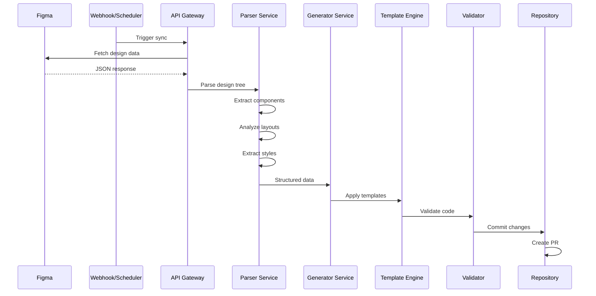

# 🔧 Figma to Code 기술 구현 상세

## 시스템 아키텍처 상세

### 1. 데이터 플로우



### 2. 핵심 모듈 구현

#### 2.1 Figma Parser

```typescript
// src/parser/figma-parser.ts

interface FigmaNode {
  id: string;
  name: string;
  type: NodeType;
  children?: FigmaNode[];
  absoluteBoundingBox: Rectangle;
  styles?: StyleMap;
  layoutMode?: 'HORIZONTAL' | 'VERTICAL';
  primaryAxisSizingMode?: string;
  counterAxisSizingMode?: string;
  paddingLeft?: number;
  paddingRight?: number;
  paddingTop?: number;
  paddingBottom?: number;
  itemSpacing?: number;
}

class FigmaParser {
  private fileKey: string;
  private apiClient: FigmaAPIClient;
  
  async parseComponent(nodeId: string): Promise<ComponentAST> {
    const node = await this.apiClient.getNode(this.fileKey, nodeId);
    return this.convertToAST(node);
  }
  
  private convertToAST(node: FigmaNode): ComponentAST {
    const ast: ComponentAST = {
      type: 'Component',
      name: this.sanitizeName(node.name),
      props: this.extractProps(node),
      styles: this.extractStyles(node),
      children: [],
    };
    
    // Auto Layout → Flex 변환
    if (node.layoutMode) {
      ast.layout = {
        display: 'flex',
        flexDirection: node.layoutMode === 'HORIZONTAL' ? 'row' : 'column',
        gap: node.itemSpacing,
        padding: {
          top: node.paddingTop,
          right: node.paddingRight,
          bottom: node.paddingBottom,
          left: node.paddingLeft,
        },
      };
    }
    
    // 자식 노드 재귀 처리
    if (node.children) {
      ast.children = node.children.map(child => 
        this.convertToAST(child)
      );
    }
    
    return ast;
  }
  
  private extractProps(node: FigmaNode): PropMap {
    const props: PropMap = {};
    
    // Component Properties 추출
    if (node.type === 'COMPONENT' || node.type === 'INSTANCE') {
      // Variants 분석
      const variantProps = this.parseVariantProperties(node.name);
      Object.assign(props, variantProps);
    }
    
    return props;
  }
  
  private parseVariantProperties(name: string): Record<string, string> {
    // "Button/Primary/Large/Default" → { variant: "Primary", size: "Large", state: "Default" }
    const parts = name.split('/');
    if (parts.length < 2) return {};
    
    return {
      variant: parts[1]?.toLowerCase(),
      size: parts[2]?.toLowerCase(),
      state: parts[3]?.toLowerCase(),
    };
  }
}
```

#### 2.2 Code Generator

```typescript
// src/generator/code-generator.ts

abstract class CodeGenerator {
  protected ast: ComponentAST;
  protected config: GeneratorConfig;
  
  abstract generate(): string;
  abstract generateStyles(): string;
  abstract generateProps(): string;
  
  protected generateImports(): string {
    const imports: Set<string> = new Set();
    this.collectImports(this.ast, imports);
    return Array.from(imports).join('\n');
  }
  
  protected collectImports(node: ComponentAST, imports: Set<string>) {
    // 재귀적으로 필요한 import 수집
    if (node.type === 'Instance') {
      imports.add(`import { ${node.componentName} } from './${node.componentName}';`);
    }
    node.children?.forEach(child => this.collectImports(child, imports));
  }
}

class FlutterGenerator extends CodeGenerator {
  generate(): string {
    const template = `
${this.generateImports()}

class ${this.ast.name} extends StatelessWidget {
  ${this.generateProps()}
  
  const ${this.ast.name}({
    Key? key,
    ${this.generateConstructorParams()}
  }) : super(key: key);
  
  @override
  Widget build(BuildContext context) {
    return ${this.generateWidget(this.ast)};
  }
}`;
    return this.formatCode(template);
  }
  
  private generateWidget(node: ComponentAST): string {
    // 레이아웃 타입에 따른 위젯 생성
    if (node.layout?.display === 'flex') {
      const direction = node.layout.flexDirection;
      const widget = direction === 'row' ? 'Row' : 'Column';
      
      return `${widget}(
        mainAxisAlignment: MainAxisAlignment.${this.mapAlignment(node.layout.justifyContent)},
        crossAxisAlignment: CrossAxisAlignment.${this.mapAlignment(node.layout.alignItems)},
        children: [
          ${node.children.map(child => this.generateWidget(child)).join(',\n')}
        ],
      )`;
    }
    
    // 기본 컨테이너
    return `Container(
      ${this.generateContainerProps(node)}
      child: ${node.children.length ? this.generateWidget(node.children[0]) : 'null'},
    )`;
  }
  
  generateStyles(): string {
    const styles = this.ast.styles;
    const dartStyles: string[] = [];
    
    if (styles.backgroundColor) {
      dartStyles.push(`color: Color(0xFF${styles.backgroundColor.slice(1)})`);
    }
    
    if (styles.borderRadius) {
      dartStyles.push(`borderRadius: BorderRadius.circular(${styles.borderRadius})`);
    }
    
    return dartStyles.join(',\n');
  }
}

class ReactGenerator extends CodeGenerator {
  generate(): string {
    const template = `
${this.generateImports()}
import styled from 'styled-components';

${this.generateStyledComponents()}

interface ${this.ast.name}Props {
  ${this.generateProps()}
}

export const ${this.ast.name}: React.FC<${this.ast.name}Props> = ({
  ${this.generateDestructuredProps()},
}) => {
  return (
    ${this.generateJSX(this.ast)}
  );
};`;
    return this.formatCode(template);
  }
  
  private generateJSX(node: ComponentAST): string {
    const StyledComponent = `Styled${node.name}`;
    
    if (node.children.length === 0) {
      return `<${StyledComponent} {...props} />`;
    }
    
    return `
    <${StyledComponent}>
      ${node.children.map(child => this.generateJSX(child)).join('\n')}
    </${StyledComponent}>`;
  }
  
  private generateStyledComponents(): string {
    return `
const Styled${this.ast.name} = styled.div\`
  ${this.generateStyles()}
\`;`;
  }
  
  generateStyles(): string {
    const styles = this.ast.styles;
    const cssRules: string[] = [];
    
    if (this.ast.layout?.display === 'flex') {
      cssRules.push('display: flex;');
      cssRules.push(`flex-direction: ${this.ast.layout.flexDirection};`);
      cssRules.push(`gap: ${this.ast.layout.gap}px;`);
    }
    
    if (styles.backgroundColor) {
      cssRules.push(`background-color: ${styles.backgroundColor};`);
    }
    
    if (styles.borderRadius) {
      cssRules.push(`border-radius: ${styles.borderRadius}px;`);
    }
    
    return cssRules.join('\n  ');
  }
}
```

#### 2.3 Template System

```typescript
// src/templates/template-engine.ts

interface TemplateContext {
  component: ComponentAST;
  imports: string[];
  props: PropDefinition[];
  styles: StyleDefinition[];
  config: TemplateConfig;
}

class TemplateEngine {
  private templates: Map<string, HandlebarsTemplate>;
  
  constructor() {
    this.loadTemplates();
    this.registerHelpers();
  }
  
  private registerHelpers() {
    // 커스텀 헬퍼 등록
    Handlebars.registerHelper('camelCase', (str: string) => 
      str.replace(/-([a-z])/g, g => g[1].toUpperCase())
    );
    
    Handlebars.registerHelper('pascalCase', (str: string) => 
      str.replace(/(?:^|-)([a-z])/g, g => g[1].toUpperCase())
    );
    
    Handlebars.registerHelper('kebabCase', (str: string) => 
      str.replace(/([A-Z])/g, '-$1').toLowerCase()
    );
  }
  
  render(templateName: string, context: TemplateContext): string {
    const template = this.templates.get(templateName);
    if (!template) {
      throw new Error(`Template ${templateName} not found`);
    }
    
    return template(context);
  }
}

// templates/flutter-component.hbs
const flutterTemplate = `
import 'package:flutter/material.dart';
{{#each imports}}
import '{{this}}';
{{/each}}

class {{pascalCase component.name}} extends StatelessWidget {
  {{#each props}}
  final {{this.type}} {{this.name}};
  {{/each}}
  
  const {{pascalCase component.name}}({
    Key? key,
    {{#each props}}
    {{#if this.required}}required {{/if}}this.{{this.name}},
    {{/each}}
  }) : super(key: key);
  
  @override
  Widget build(BuildContext context) {
    return {{> widget component}};
  }
}
`;
```

### 3. 스타일 시스템 매핑

```typescript
// src/styles/style-mapper.ts

class StyleMapper {
  private tokenMap: Map<string, DesignToken>;
  
  mapFigmaToFlutter(figmaStyles: FigmaStyles): FlutterStyles {
    return {
      decoration: BoxDecoration({
        color: this.mapColor(figmaStyles.fills),
        borderRadius: this.mapBorderRadius(figmaStyles.cornerRadius),
        boxShadow: this.mapShadows(figmaStyles.effects),
        border: this.mapBorder(figmaStyles.strokes),
      }),
      padding: this.mapPadding(figmaStyles.padding),
      margin: this.mapMargin(figmaStyles.margin),
    };
  }
  
  mapFigmaToCSS(figmaStyles: FigmaStyles): CSSStyles {
    return {
      backgroundColor: this.mapColor(figmaStyles.fills),
      borderRadius: `${figmaStyles.cornerRadius}px`,
      boxShadow: this.mapShadowsToCSS(figmaStyles.effects),
      border: this.mapBorderToCSS(figmaStyles.strokes),
      padding: this.mapPaddingToCSS(figmaStyles.padding),
      margin: this.mapMarginToCSS(figmaStyles.margin),
    };
  }
  
  private mapColor(fills: FigmaFill[]): string {
    const solidFill = fills.find(f => f.type === 'SOLID');
    if (!solidFill) return 'transparent';
    
    const { r, g, b, a } = solidFill.color;
    return `rgba(${r * 255}, ${g * 255}, ${b * 255}, ${a})`;
  }
}
```

### 4. 변경 감지 시스템

```typescript
// src/sync/change-detector.ts

class ChangeDetector {
  private lastSyncState: SyncState;
  private diffEngine: DiffEngine;
  
  async detectChanges(currentState: FigmaFileState): Promise<ChangeSet> {
    const changes: ChangeSet = {
      added: [],
      modified: [],
      deleted: [],
    };
    
    // 컴포넌트 레벨 변경 감지
    for (const [id, component] of currentState.components) {
      const lastVersion = this.lastSyncState.components.get(id);
      
      if (!lastVersion) {
        changes.added.push(component);
      } else if (this.hasChanged(component, lastVersion)) {
        changes.modified.push({
          before: lastVersion,
          after: component,
          diff: this.diffEngine.diff(lastVersion, component),
        });
      }
    }
    
    // 삭제된 컴포넌트 감지
    for (const [id, component] of this.lastSyncState.components) {
      if (!currentState.components.has(id)) {
        changes.deleted.push(component);
      }
    }
    
    return changes;
  }
  
  private hasChanged(a: Component, b: Component): boolean {
    // 버전 비교
    if (a.version !== b.version) return true;
    
    // 구조적 변경 감지
    const aHash = this.computeHash(a);
    const bHash = this.computeHash(b);
    
    return aHash !== bHash;
  }
  
  private computeHash(component: Component): string {
    // 컴포넌트의 구조적 해시 계산
    return crypto
      .createHash('sha256')
      .update(JSON.stringify(component))
      .digest('hex');
  }
}
```

### 5. CI/CD Integration

```yaml
# .github/workflows/figma-sync.yml

name: Figma Design Sync

on:
  schedule:
    - cron: '0 */6 * * *' # 6시간마다
  workflow_dispatch:
    inputs:
      components:
        description: 'Specific components to sync (comma-separated)'
        required: false
      force:
        description: 'Force regeneration'
        type: boolean
        default: false

jobs:
  sync:
    runs-on: ubuntu-latest
    
    steps:
      - uses: actions/checkout@v3
      
      - name: Setup Node.js
        uses: actions/setup-node@v3
        with:
          node-version: '18'
          cache: 'npm'
      
      - name: Install dependencies
        run: npm ci
      
      - name: Fetch Figma data
        env:
          FIGMA_TOKEN: ${{ secrets.FIGMA_TOKEN }}
          FIGMA_FILE_KEY: ${{ secrets.FIGMA_FILE_KEY }}
        run: |
          npm run figma:fetch
      
      - name: Detect changes
        id: changes
        run: |
          npm run figma:detect-changes
          echo "has_changes=$(npm run figma:has-changes --silent)" >> $GITHUB_OUTPUT
      
      - name: Generate code
        if: steps.changes.outputs.has_changes == 'true' || github.event.inputs.force == 'true'
        run: |
          npm run figma:generate -- \
            --flutter ./packages/flutter/lib/generated \
            --react ./packages/web/src/generated
      
      - name: Run tests
        run: |
          npm run test:generated
          npm run lint:generated
      
      - name: Visual regression test
        run: |
          npm run test:visual
      
      - name: Create Pull Request
        if: steps.changes.outputs.has_changes == 'true'
        uses: peter-evans/create-pull-request@v5
        with:
          token: ${{ secrets.GITHUB_TOKEN }}
          commit-message: '[Auto] Sync Figma designs'
          title: '🎨 [Auto] Figma Design Sync - ${{ steps.changes.outputs.summary }}'
          body: |
            ## 🎨 Figma Design Sync
            
            ### Changes detected:
            ${{ steps.changes.outputs.changelog }}
            
            ### Affected components:
            ${{ steps.changes.outputs.components }}
            
            ### Visual diff:
            ${{ steps.changes.outputs.visual_diff_url }}
            
            ---
            *This PR was automatically generated by Figma Sync workflow*
          branch: figma-sync-${{ github.run_number }}
          reviewers: frontend-team
          assignees: design-system-maintainers
```

### 6. 테스트 전략

```typescript
// tests/generator.test.ts

describe('Code Generator', () => {
  describe('Flutter Generator', () => {
    it('should generate valid Flutter widget', async () => {
      const ast = await parser.parse('button-component-id');
      const code = flutterGenerator.generate(ast);
      
      // Dart 문법 검증
      const isValidDart = await validateDartSyntax(code);
      expect(isValidDart).toBe(true);
      
      // 예상 구조 검증
      expect(code).toContain('class GPButton extends StatelessWidget');
      expect(code).toContain('Widget build(BuildContext context)');
    });
    
    it('should handle Auto Layout correctly', async () => {
      const ast = mockAutoLayoutAST();
      const code = flutterGenerator.generate(ast);
      
      expect(code).toContain('Row(');
      expect(code).toContain('mainAxisAlignment: MainAxisAlignment.spaceBetween');
    });
  });
  
  describe('React Generator', () => {
    it('should generate valid React component', async () => {
      const ast = await parser.parse('button-component-id');
      const code = reactGenerator.generate(ast);
      
      // TypeScript 문법 검증
      const isValidTS = await validateTypeScript(code);
      expect(isValidTS).toBe(true);
      
      // React 패턴 검증
      expect(code).toContain('React.FC<');
      expect(code).toContain('export const GPButton');
    });
  });
});

// Visual regression test
describe('Visual Regression', () => {
  it('should match visual snapshot', async () => {
    const component = await generateComponent('button');
    const screenshot = await renderAndCapture(component);
    
    expect(screenshot).toMatchImageSnapshot({
      threshold: 0.95, // 95% 일치
    });
  });
});
```

## 성능 최적화

### 1. 캐싱 전략

```typescript
class CacheManager {
  private redis: RedisClient;
  
  async get(key: string): Promise<any> {
    const cached = await this.redis.get(key);
    if (cached) {
      return JSON.parse(cached);
    }
    return null;
  }
  
  async set(key: string, value: any, ttl: number = 3600) {
    await this.redis.setex(
      key,
      ttl,
      JSON.stringify(value)
    );
  }
  
  getCacheKey(fileKey: string, nodeId: string, version: string): string {
    return `figma:${fileKey}:${nodeId}:${version}`;
  }
}
```

### 2. 증분 업데이트

```typescript
class IncrementalUpdater {
  async updateComponent(componentId: string, changes: ChangeSet) {
    // 변경된 부분만 재생성
    const affectedFiles = this.findAffectedFiles(componentId);
    
    for (const file of affectedFiles) {
      const ast = await this.parser.parsePartial(file, changes);
      const code = this.generator.generatePartial(ast, changes);
      await this.writeFile(file, code);
    }
  }
}
```

## 모니터링 및 분석

### 대시보드 메트릭

```typescript
interface SyncMetrics {
  totalComponents: number;
  syncedComponents: number;
  failedComponents: number;
  averageSyncTime: number;
  lastSyncTime: Date;
  codeQualityScore: number;
  visualMatchScore: number;
}

class MetricsCollector {
  async collectMetrics(): Promise<SyncMetrics> {
    return {
      totalComponents: await this.countTotalComponents(),
      syncedComponents: await this.countSyncedComponents(),
      failedComponents: await this.countFailedComponents(),
      averageSyncTime: await this.calculateAverageSyncTime(),
      lastSyncTime: await this.getLastSyncTime(),
      codeQualityScore: await this.calculateCodeQuality(),
      visualMatchScore: await this.calculateVisualMatch(),
    };
  }
}
```

---

*Technical Documentation v1.0*
*Last Updated: 2024.11.15*