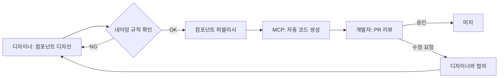

# Figma MCP 시스템 팀 가이드라인

> **대상**: 디자이너, 개발자, PM  
> **목적**: Figma-Flutter 자동 동기화 시스템 효과적 활용을 위한 협업 규칙  
> **작성일**: 2025-08-14

---

## 🎨 디자이너 필수 숙지사항

### 1. 컴포넌트 네이밍 규칙 ⚠️ **매우 중요**

```
✅ 올바른 예시:
- Button/Primary/Large
- Input/Text/Default
- Card/Product/Featured
- Modal/Alert/Error

❌ 잘못된 예시:
- 버튼1
- Rectangle 2843
- Group 123
- 임시_테스트
```

### 2. 컴포넌트 구조 규칙

#### 필수 레이어 구조
```
📁 Button/Primary/Large
  ├── 🔲 Background (자동 인식: 배경색)
  ├── 📝 Label (자동 인식: 텍스트)
  ├── 🎨 Icon (선택사항)
  └── 📐 Padding (자동 계산)
```

#### 상태 관리
```
📁 Input/Text
  ├── 📄 Default
  ├── 📄 Focused
  ├── 📄 Error
  └── 📄 Disabled
```

### 3. 디자인 토큰 관리

#### 색상 스타일
```figma
필수 색상 스타일:
- Primary/500 → #47755C (메인 색상)
- Gray/900 → #344054 (텍스트)
- Error/500 → #FF3B30 (에러)
- Success/500 → #34C759 (성공)

⚠️ 로컬 색상 사용 금지!
모든 색상은 스타일로 등록 필수
```

#### 텍스트 스타일
```figma
필수 텍스트 스타일:
- Headline/1 → 24px, Bold
- Body/1 → 16px, Regular
- Caption/1 → 12px, Regular

⚠️ 로컬 텍스트 스타일 사용 금지!
```

### 4. 컴포넌트 변경 시 체크리스트

- [ ] 컴포넌트명이 규칙을 따르는가?
- [ ] Variant 속성이 명확한가?
- [ ] Auto Layout이 적용되어 있는가?
- [ ] 디자인 토큰을 사용했는가?
- [ ] 설명(Description)을 작성했는가?

### 5. 금지 사항 🚫

```
❌ 컴포넌트 이름에 한글 사용
❌ 마스터 컴포넌트 직접 수정
❌ 로컬 스타일 사용
❌ Group으로만 묶기 (Frame 사용)
❌ 절대 위치 사용 (Auto Layout 사용)
```

---

## 💻 개발자 필수 숙지사항

### 1. 자동 생성 코드 관리

#### 생성된 파일 구조
```
lib/
├── generated/           # ⚠️ 수정 금지 (자동 생성)
│   ├── theme.dart
│   ├── tokens.dart
│   └── components/
├── custom/             # ✅ 커스터마이징 영역
│   ├── extensions/
│   └── overrides/
└── screens/            # ✅ 화면 구현
```

#### Override 패턴
```dart
// ❌ 잘못된 방법: 생성된 파일 직접 수정
// lib/generated/components/primary_button.dart
class PrimaryButton extends StatelessWidget {
  // 이 파일 수정하면 다음 동기화 때 덮어씌워짐!
}

// ✅ 올바른 방법: 확장 클래스 생성
// lib/custom/extensions/primary_button_ext.dart
class CustomPrimaryButton extends PrimaryButton {
  // 추가 기능 구현
  @override
  Widget build(BuildContext context) {
    // 커스텀 로직
    return super.build(context);
  }
}
```

### 2. 동기화 트리거 이해

#### 자동 동기화 발생 조건
- Figma 파일 저장 (5분 지연)
- 컴포넌트 퍼블리시
- 수동 동기화 명령

#### 동기화 제외 설정
```yaml
# .figma-sync.yaml
exclude:
  - "**/Draft/**"      # Draft 폴더 제외
  - "**/Archive/**"    # Archive 폴더 제외
  - "**/*_temp"        # _temp로 끝나는 항목 제외
```

### 3. 충돌 해결 프로세스

```bash
# PR 자동 생성 시 충돌 발생
git checkout figma-sync-2025-08-14
git rebase main

# 충돌 해결 원칙
# 1. generated/ 폴더: Figma 우선
# 2. custom/ 폴더: 로컬 우선
# 3. 불확실한 경우: 디자이너와 협의
```

### 4. 로컬 테스트

```bash
# MCP 서버 로컬 실행
npm run dev:mcp

# 특정 컴포넌트만 동기화
npm run sync:component Button/Primary

# 드라이런 (실제 파일 생성 X)
npm run sync:dry-run
```

---

## 🤝 디자이너-개발자 협업 프로토콜

### 1. 컴포넌트 생성 워크플로우



### 2. 커뮤니케이션 규칙

#### Figma 코멘트 규칙
```
@dev: 개발자 확인 필요
@design: 디자이너 확인 필요
@blocked: 진행 불가 이슈
@question: 질문/논의 필요
```

#### Slack 알림 설정
```yaml
notifications:
  - channel: "#design-system"
    events:
      - component_published
      - sync_failed
  - channel: "#dev-flutter"
    events:
      - pr_created
      - merge_conflict
```

### 3. 버전 관리

#### Figma 버전 태깅
```
v1.0.0-design: 초기 디자인 완료
v1.0.1-design: 색상 수정
v1.1.0-design: 새 컴포넌트 추가
```

#### 코드 버전 태깅
```
v1.0.0-flutter: 초기 구현
v1.0.1-flutter: 버그 수정
v1.1.0-flutter: 기능 추가
```

---

## 📋 체크리스트

### 디자이너 일일 체크리스트
- [ ] 작업 전 최신 컴포넌트 라이브러리 동기화
- [ ] 새 컴포넌트 네이밍 규칙 확인
- [ ] 디자인 토큰 사용 여부 확인
- [ ] 컴포넌트 설명 작성
- [ ] 퍼블리시 전 개발자와 협의

### 개발자 일일 체크리스트
- [ ] MCP 서버 상태 확인
- [ ] 자동 생성 PR 리뷰
- [ ] 충돌 발생 시 디자이너와 협의
- [ ] 커스텀 코드 별도 폴더 관리
- [ ] 테스트 코드 업데이트

---

## 🚨 트러블슈팅

### 자주 발생하는 문제

#### 1. 컴포넌트가 코드로 변환되지 않음
```
원인: 네이밍 규칙 미준수
해결: 
1. Figma에서 컴포넌트명 확인
2. Button/Primary/Large 형식으로 수정
3. 다시 퍼블리시
```

#### 2. 생성된 코드가 의도와 다름
```
원인: 매핑 규칙 불일치
해결:
1. mapping_rules.yaml 확인
2. 필요시 규칙 추가/수정
3. MCP 서버 재시작
```

#### 3. PR 충돌 발생
```
원인: 수동 수정과 자동 생성 충돌
해결:
1. generated/ 폴더는 항상 Figma 우선
2. 커스텀 로직은 custom/ 폴더로 이동
```

---

## 📚 교육 자료

### 디자이너용
- [Figma 컴포넌트 베스트 프랙티스](./figma-best-practices.md)
- [디자인 토큰 이해하기](./design-tokens-guide.md)
- [Auto Layout 마스터하기](./auto-layout-guide.md)

### 개발자용
- [MCP 서버 아키텍처](./mcp-architecture.md)
- [Flutter 코드 생성 원리](./code-generation.md)
- [커스터마이징 가이드](./customization-guide.md)

### 공통
- [협업 워크플로우](./collaboration-workflow.md)
- [버전 관리 전략](./version-strategy.md)
- [문제 해결 가이드](./troubleshooting.md)

---

## 🎯 KPI 및 목표

### 측정 지표
- 디자인→코드 반영 시간: < 10분
- 자동 생성 성공률: > 95%
- 수동 코딩 비율: < 20%
- 디자인-코드 일치율: 100%

### 월간 리뷰
- 실패한 동기화 분석
- 네이밍 규칙 위반 사례
- 개선 제안 수집
- 교육 필요 사항 파악

---

## 🔐 권한 관리

### Figma 권한
```
Admin: 컴포넌트 라이브러리 관리
Editor: 컴포넌트 생성/수정
Viewer: 읽기 전용
```

### GitHub 권한
```
Maintainer: 자동 PR 머지 권한
Developer: PR 리뷰/수정
Observer: 읽기 전용
```

### MCP 서버 권한
```
Admin: 설정 변경, 수동 동기화
User: 상태 확인, 로그 조회
```

---

## 📞 지원 채널

- **긴급 이슈**: #figma-mcp-urgent
- **일반 문의**: #design-system
- **버그 리포트**: GitHub Issues
- **개선 제안**: Confluence 페이지

---

**중요**: 이 시스템은 디자이너와 개발자의 긴밀한 협업이 필수입니다. 규칙을 준수하고 적극적으로 소통해주세요! 🚀